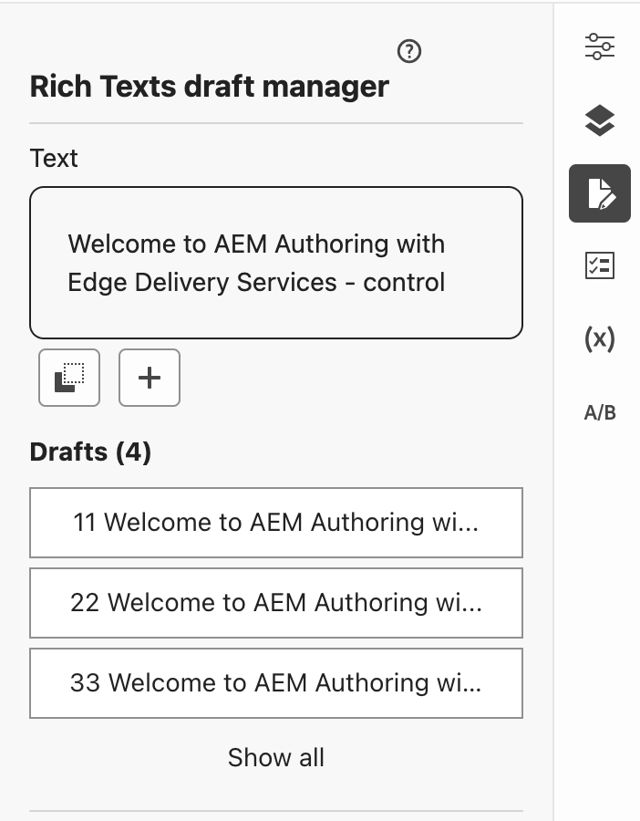

# Content Drafts

## Universal Editor Extensibility
This extension is an example of how to extend the Universal Editor with custom functionality.
The Universal Editor is a headless content management system that allows users to create, manage, and publish content across multiple channels. It provides a set of core features that can be extended with custom functionality using extensions.

### Documentation
In this link, you can find the documentation of the UI extensibility: [UIExtensibility Documentation](https://developer.adobe.com/uix/docs)

To get more information about the universal editor extension points, please refer to the [Universal Editor Extension Points](https://developer.adobe.com/uix/docs/services/aem-universal-editor/) documentation.
## Functionality

The `universal-editor-richtext-draft` extension provides a rich text editor with draft management capabilities. This allows users to create, edit, and manage multiple drafts of their content of type `reachtext` directly within the editor.



### Features

- **Rich Text Editing**: The extension provides a rich text editor where users can input and format their text.

- **Draft Management**: Users can create multiple drafts of their content. Each draft is saved separately, allowing users to switch between different versions of their content easily.

- **Draft Preview**: Each draft can be previewed allowing users to check their drafts before finalizing their content.

- **Draft Actions**: For each draft, users can perform several actions including reverting changes, adding a new draft, selecting a draft, applying a draft, and deleting a draft.

Please refer to the `src/universal-editor-ui-1/web-src/src/components` file for the implementation details.

### How to use
After enabling the extension in the Universal Editor, you should see the extension in the rail panel as the follow:


- Start by clicking on the text you want to change. After making the changes, click on the add button to create a draft.</li>
- If you don't want to add the draft, click the revert button to cancel the change.</li>
- You can select a draft from the list to persist or delete it.</li>
- You can not edit a draft, only save or delete it. For that, delete the draft and create a new one</li>

The drafts are persisted on the browser. If you clear the cache, you will lose them.
The minimum length of a draft is `50` characters.

## Setup

- Populate the `.env` file in the project root and fill it as shown [below](#env)

## Local Dev

- `aio app run` to start your local Dev server
- App will run on `localhost:9080` by default

By default the UI will be served locally but actions will be deployed and served from Adobe I/O Runtime. To start a
local serverless stack and also run your actions locally use the `aio app run --local` option.

## Test & Coverage

- Run `aio app test` to run unit tests for ui and actions
- Run `aio app test --e2e` to run e2e tests

## Deploy & Cleanup

- `aio app deploy` to build and deploy all actions on Runtime and static files to CDN
- `aio app undeploy` to undeploy the app

## Config

### `.env`

You can generate this file using the command `aio app use`. 
Add this line to the generated .env file
```bash
UNIVERSAL_EDITOR_URL=https://universal-editor-service.experiencecloud.live
```

```bash
# This file must **not** be committed to source control

## please provide your Adobe I/O Runtime credentials
# AIO_RUNTIME_AUTH=
# AIO_RUNTIME_NAMESPACE=
```

### `app.config.yaml`

- Main configuration file that defines an application's implementation. 
- More information on this file, application configuration, and extension configuration 
  can be found [here](https://developer.adobe.com/app-builder/docs/guides/appbuilder-configuration/#appconfigyaml)

#### Action Dependencies

- You have two options to resolve your actions' dependencies:

  1. **Packaged action file**: Add your action's dependencies to the root
   `package.json` and install them using `npm install`. Then set the `function`
   field in `app.config.yaml` to point to the **entry file** of your action
   folder. We will use `webpack` to package your code and dependencies into a
   single minified js file. The action will then be deployed as a single file.
   Use this method if you want to reduce the size of your actions.

  2. **Zipped action folder**: In the folder containing the action code add a
     `package.json` with the action's dependencies. Then set the `function`
     field in `app.config.yaml` to point to the **folder** of that action. We will
     install the required dependencies within that directory and zip the folder
     before deploying it as a zipped action. Use this method if you want to keep
     your action's dependencies separated.

## Debugging in VS Code

While running your local server (`aio app run`), both UI and actions can be debugged, to do so open the vscode debugger
and select the debugging configuration called `WebAndActions`.
Alternatively, there are also debug configs for only UI and each separate action.

## Typescript support for UI

To use typescript use `.tsx` extension for react components and add a `tsconfig.json` 
and make sure you have the below config added
```
 {
  "compilerOptions": {
      "jsx": "react"
    }
  } 
```
